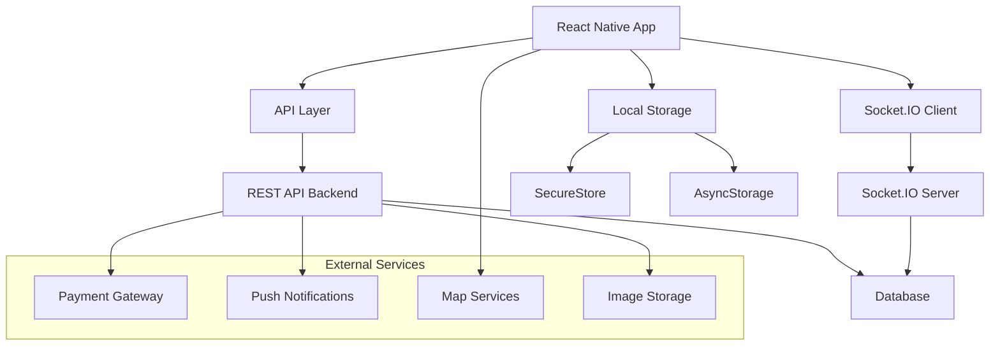

# Design Document

## Overview

This design document outlines the architecture and implementation approach for completing the RealStay real estate application. The app follows a React Native Expo architecture with TypeScript, using a REST API backend with Socket.IO for real-time communication. The design builds upon the existing foundation while adding comprehensive features for property search, booking management, enhanced communication, and user experience improvements.

## Architecture

### High-Level Architecture



### Current Architecture Analysis

The app currently uses:

- **Navigation**: Expo Router with file-based routing
- **State Management**: Jotai for global state, React hooks for local state
- **API Communication**: Custom apiClient with cold start handling
- **Real-time**: Socket.IO for chat functionality
- **Storage**: SecureStore for tokens, likely AsyncStorage for other data
- **UI**: Custom themed components with React Native Reanimated
- **Styling**: Theme-based styling system

### Enhanced Architecture Components

#### 1. Data Layer Enhancement

- **API Client**: Extend existing apiClient with caching and offline support
- **State Management**: Add React Query for server state management
- **Local Database**: Implement SQLite for offline data storage
- **Image Management**: Add image caching and optimization

#### 2. Feature Modules

- **Search Module**: Advanced filtering and search capabilities
- **Booking Module**: Reservation management and payment processing
- **Chat Module**: Enhanced messaging with file support
- **Profile Module**: User management and preferences
- **Review Module**: Rating and review system
- **Notification Module**: Push and in-app notifications

## Components and Interfaces

### Core Data Models

#### Enhanced Listing Model

```typescript
interface Listing {
  id: string;
  title: string;
  description: string;
  propertyType: PropertyType;
  location: {
    address: string;
    city: string;
    state: string;
    country: string;
    coordinates: {
      latitude: number;
      longitude: number;
    };
  };
  pricing: {
    basePrice: number;
    currency: string;
    cleaningFee?: number;
    serviceFee?: number;
  };
  capacity: {
    guests: number;
    bedrooms: number;
    beds: number;
    bathrooms: number;
  };
  amenities: string[];
  images: string[];
  availability: {
    calendar: AvailabilitySlot[];
    minimumStay: number;
    maximumStay?: number;
  };
  host: {
    id: string;
    name: string;
    avatar?: string;
    isSuperhost: boolean;
    responseRate: number;
    responseTime: string;
  };
  reviews: {
    averageRating: number;
    totalReviews: number;
    breakdown: RatingBreakdown;
  };
  policies: {
    checkIn: string;
    checkOut: string;
    cancellationPolicy: CancellationPolicy;
    houseRules: string[];
  };
  status: "active" | "inactive" | "pending";
  createdAt: string;
  updatedAt: string;
}
```

#### Booking System Models

```typescript
interface Booking {
  id: string;
  listingId: string;
  guestId: string;
  hostId: string;
  dates: {
    checkIn: string;
    checkOut: string;
    nights: number;
  };
  guests: {
    adults: number;
    children: number;
    infants: number;
  };
  pricing: {
    baseAmount: number;
    cleaningFee: number;
    serviceFee: number;
    taxes: number;
    totalAmount: number;
  };
  payment: {
    method: PaymentMethod;
    status: PaymentStatus;
    transactionId?: string;
  };
  status: BookingStatus;
  specialRequests?: string;
  createdAt: string;
  updatedAt: string;
}

type BookingStatus = "pending" | "confirmed" | "cancelled" | "completed";
type PaymentStatus = "pending" | "paid" | "failed" | "refunded";
```

#### Enhanced Chat Models

```typescript
interface ChatConversation {
  id: string;
  participants: string[];
  listingId?: string;
  bookingId?: string;
  lastMessage: ChatMessage;
  unreadCount: number;
  createdAt: string;
  updatedAt: string;
}

interface ChatMessage {
  id: string;
  conversationId: string;
  senderId: string;
  content?: string;
  attachments?: MessageAttachment[];
  messageType: "text" | "image" | "file" | "system";
  status: "sending" | "sent" | "delivered" | "read";
  timestamp: string;
}

interface MessageAttachment {
  id: string;
  type: "image" | "document";
  url: string;
  filename: string;
  size: number;
  mimeType: string;
}
```

### API Interface Design

#### Search and Filter API

```typescript
interface SearchParams {
  query?: string;
  location?: {
    latitude: number;
    longitude: number;
    radius: number;
  };
  dates?: {
    checkIn: string;
    checkOut: string;
  };
  guests?: number;
  priceRange?: {
    min: number;
    max: number;
  };
  propertyTypes?: PropertyType[];
  amenities?: string[];
  sortBy?: "price" | "rating" | "distance" | "newest";
  sortOrder?: "asc" | "desc";
  page?: number;
  limit?: number;
}

interface SearchResponse {
  listings: Listing[];
  totalCount: number;
  filters: {
    priceRange: { min: number; max: number };
    availableAmenities: string[];
    propertyTypes: PropertyType[];
  };
  pagination: {
    page: number;
    limit: number;
    totalPages: number;
  };
}
```

#### Booking API

```typescript
interface BookingRequest {
  listingId: string;
  checkIn: string;
  checkOut: string;
  guests: {
    adults: number;
    children: number;
    infants: number;
  };
  paymentMethod: PaymentMethod;
  specialRequests?: string;
}

interface BookingResponse {
  booking: Booking;
  paymentIntent?: {
    clientSecret: string;
    amount: number;
  };
}
```

### Component Architecture

#### Search Components

```typescript
// Enhanced search with filters
<SearchScreen>
  <SearchHeader />
  <SearchFilters />
  <SearchResults />
  <MapView />
</SearchScreen>

// Filter components
<FilterModal>
  <PriceRangeFilter />
  <PropertyTypeFilter />
  <AmenitiesFilter />
  <DateRangeFilter />
</FilterModal>
```

#### Booking Components

```typescript
// Booking flow
<BookingFlow>
  <DateSelection />
  <GuestSelection />
  <PricingBreakdown />
  <PaymentForm />
  <BookingConfirmation />
</BookingFlow>

// Booking management
<BookingManagement>
  <BookingList />
  <BookingDetails />
  <BookingActions />
</BookingManagement>
```

#### Enhanced Chat Components

```typescript
// Chat system
<ChatSystem>
  <ConversationList />
  <ChatScreen>
    <ChatHeader />
    <MessageList />
    <MessageInput />
    <AttachmentPicker />
  </ChatScreen>
</ChatSystem>
```

## Data Models

### Database Schema Design

#### Users Table Enhancement

```sql
CREATE TABLE users (
  id UUID PRIMARY KEY,
  email VARCHAR UNIQUE NOT NULL,
  password_hash VARCHAR NOT NULL,
  first_name VARCHAR NOT NULL,
  last_name VARCHAR NOT NULL,
  phone_number VARCHAR,
  avatar_url VARCHAR,
  date_of_birth DATE,
  gender VARCHAR,
  user_type ENUM('guest', 'host', 'both'),
  verification_status ENUM('unverified', 'email_verified', 'phone_verified', 'id_verified'),
  preferences JSONB,
  created_at TIMESTAMP DEFAULT NOW(),
  updated_at TIMESTAMP DEFAULT NOW()
);
```

#### Listings Table

```sql
CREATE TABLE listings (
  id UUID PRIMARY KEY,
  host_id UUID REFERENCES users(id),
  title VARCHAR NOT NULL,
  description TEXT,
  property_type VARCHAR NOT NULL,
  address TEXT NOT NULL,
  city VARCHAR NOT NULL,
  state VARCHAR NOT NULL,
  country VARCHAR NOT NULL,
  latitude DECIMAL(10, 8),
  longitude DECIMAL(11, 8),
  base_price DECIMAL(10, 2) NOT NULL,
  currency VARCHAR(3) DEFAULT 'USD',
  cleaning_fee DECIMAL(10, 2),
  service_fee DECIMAL(10, 2),
  guests INTEGER NOT NULL,
  bedrooms INTEGER NOT NULL,
  beds INTEGER NOT NULL,
  bathrooms INTEGER NOT NULL,
  amenities TEXT[],
  images TEXT[],
  minimum_stay INTEGER DEFAULT 1,
  maximum_stay INTEGER,
  check_in_time TIME,
  check_out_time TIME,
  cancellation_policy VARCHAR,
  house_rules TEXT[],
  status VARCHAR DEFAULT 'active',
  created_at TIMESTAMP DEFAULT NOW(),
  updated_at TIMESTAMP DEFAULT NOW()
);
```

#### Bookings Table

```sql
CREATE TABLE bookings (
  id UUID PRIMARY KEY,
  listing_id UUID REFERENCES listings(id),
  guest_id UUID REFERENCES users(id),
  host_id UUID REFERENCES users(id),
  check_in DATE NOT NULL,
  check_out DATE NOT NULL,
  adults INTEGER NOT NULL,
  children INTEGER DEFAULT 0,
  infants INTEGER DEFAULT 0,
  base_amount DECIMAL(10, 2) NOT NULL,
  cleaning_fee DECIMAL(10, 2),
  service_fee DECIMAL(10, 2),
  taxes DECIMAL(10, 2),
  total_amount DECIMAL(10, 2) NOT NULL,
  payment_method VARCHAR,
  payment_status VARCHAR DEFAULT 'pending',
  booking_status VARCHAR DEFAULT 'pending',
  special_requests TEXT,
  created_at TIMESTAMP DEFAULT NOW(),
  updated_at TIMESTAMP DEFAULT NOW()
);
```

### State Management Design

#### Global State Structure

```typescript
// Using Jotai atoms for global state
export const userAtom = atom<User | null>(null);
export const authTokenAtom = atom<string | null>(null);
export const searchFiltersAtom = atom<SearchFilters>({});
export const currentLocationAtom = atom<Location | null>(null);
export const notificationSettingsAtom = atom<NotificationSettings>({});

// Derived atoms
export const isAuthenticatedAtom = atom((get) => get(authTokenAtom) !== null);

export const userTypeAtom = atom((get) => get(userAtom)?.user_type || "guest");
```

#### React Query Integration

```typescript
// Query keys
export const queryKeys = {
  listings: ["listings"] as const,
  listing: (id: string) => ["listings", id] as const,
  bookings: ["bookings"] as const,
  booking: (id: string) => ["bookings", id] as const,
  conversations: ["conversations"] as const,
  conversation: (id: string) => ["conversations", id] as const,
  user: (id: string) => ["users", id] as const,
};

// Custom hooks
export const useListings = (params: SearchParams) => {
  return useQuery({
    queryKey: [...queryKeys.listings, params],
    queryFn: () => searchListings(params),
    staleTime: 5 * 60 * 1000, // 5 minutes
  });
};

export const useBookings = () => {
  return useQuery({
    queryKey: queryKeys.bookings,
    queryFn: fetchUserBookings,
    enabled: !!useAtomValue(authTokenAtom),
  });
};
```

## Error Handling

### Error Types and Handling Strategy

#### API Error Handling

```typescript
interface ApiError {
  code: string;
  message: string;
  details?: any;
  statusCode: number;
}

class ErrorHandler {
  static handle(error: ApiError) {
    switch (error.code) {
      case "NETWORK_ERROR":
        toast.error("Please check your internet connection");
        break;
      case "UNAUTHORIZED":
        // Redirect to login
        router.replace("/login");
        break;
      case "BOOKING_UNAVAILABLE":
        toast.error("These dates are no longer available");
        break;
      case "PAYMENT_FAILED":
        toast.error("Payment failed. Please try again.");
        break;
      default:
        toast.error(error.message || "An unexpected error occurred");
    }
  }
}
```

#### Offline Error Handling

```typescript
interface OfflineAction {
  type: string;
  payload: any;
  timestamp: number;
  retryCount: number;
}

class OfflineManager {
  private queue: OfflineAction[] = [];

  queueAction(action: OfflineAction) {
    this.queue.push(action);
    AsyncStorage.setItem("offline_queue", JSON.stringify(this.queue));
  }

  async processQueue() {
    const actions = [...this.queue];
    this.queue = [];

    for (const action of actions) {
      try {
        await this.executeAction(action);
      } catch (error) {
        if (action.retryCount < 3) {
          this.queueAction({
            ...action,
            retryCount: action.retryCount + 1,
          });
        }
      }
    }
  }
}
```

## Testing Strategy

### Testing Approach

#### Unit Testing

- **Components**: Test individual components with React Native Testing Library
- **Hooks**: Test custom hooks with @testing-library/react-hooks
- **Utils**: Test utility functions with Jest
- **API Client**: Mock API responses and test error handling

#### Integration Testing

- **Navigation**: Test screen transitions and deep linking
- **State Management**: Test atom updates and derived state
- **Real-time Features**: Test Socket.IO integration with mock server

#### E2E Testing

- **Critical Flows**: Test booking flow, search, and chat functionality
- **Platform Testing**: Test on both iOS and Android
- **Performance Testing**: Test app performance with large datasets

### Testing Structure

```typescript
// Component testing example
describe("ListingCard", () => {
  it("displays listing information correctly", () => {
    const mockListing = createMockListing();
    render(<ListingCard listing={mockListing} />);

    expect(screen.getByText(mockListing.title)).toBeVisible();
    expect(screen.getByText(mockListing.location.city)).toBeVisible();
  });

  it("handles bookmark toggle", () => {
    const onBookmarkToggle = jest.fn();
    render(<ListingCard onBookmarkToggle={onBookmarkToggle} />);

    fireEvent.press(screen.getByTestId("bookmark-button"));
    expect(onBookmarkToggle).toHaveBeenCalled();
  });
});

// API testing example
describe("API Client", () => {
  it("handles cold start gracefully", async () => {
    mockFetch.mockResolvedValueOnce({
      ok: false,
      status: 503,
    });

    const result = await apiRequest("/listings");
    expect(result.serverStatus).toBe("warming-up");
  });
});
```

## Implementation Phases

### Phase 1: Enhanced Search and Filtering (Week 1-2)

- Implement advanced search API integration
- Add filter components and state management
- Enhance map integration with clustering
- Add search result caching

### Phase 2: Booking System (Week 3-4)

- Build booking flow components
- Integrate payment processing
- Add booking management screens
- Implement availability checking

### Phase 3: Enhanced Communication (Week 5)

- Upgrade chat system with file attachments
- Add push notifications
- Implement conversation management
- Add message status indicators

### Phase 4: User Experience Enhancements (Week 6)

- Complete profile management
- Add review and rating system
- Implement notification preferences
- Add offline support

### Phase 5: Testing and Polish (Week 7-8)

- Comprehensive testing
- Performance optimization
- Bug fixes and refinements
- App store preparation

This design provides a comprehensive roadmap for completing the RealStay application while building upon the existing architecture and maintaining code quality standards.
